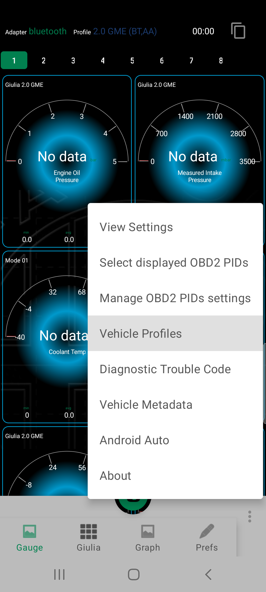
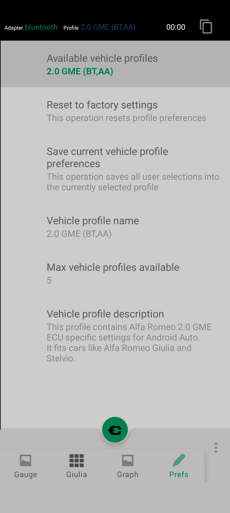
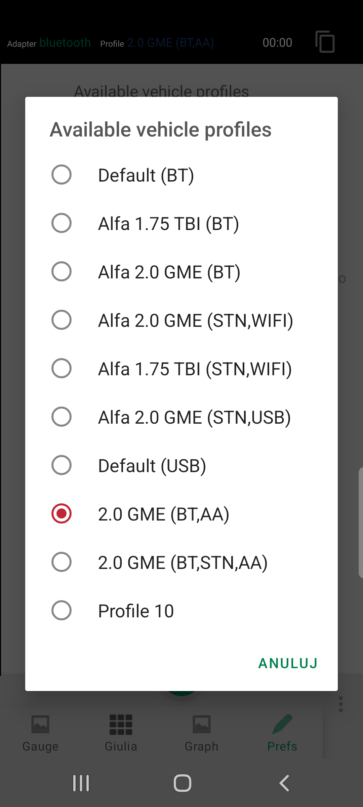

#  Adding new PIDs to query and displaying on AA virtual screen 

## Step.1: Open `Vehicle Profiles` screen 

## Step.2: Hit `Available vehicle profiles` item

## Step.3: Select interesting Vehicle profiles from the list
