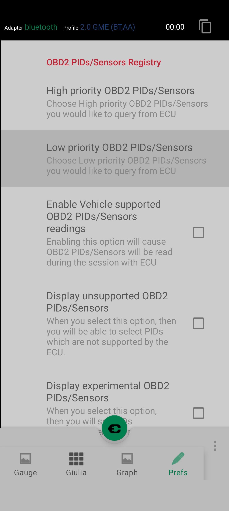
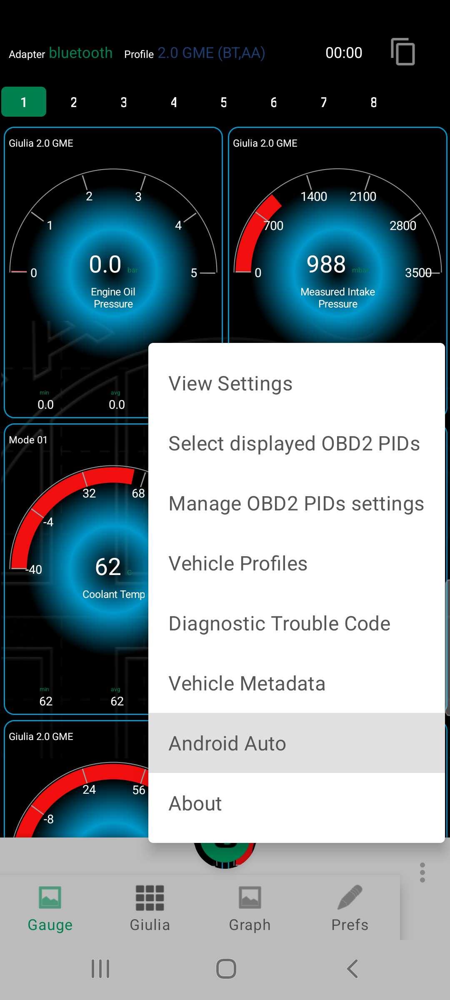

#  Adding new PIDs to query and displaying on AA virtual screen 

## Step.1: Open `Manage OBD2 PIDs settings` screen 

## Step.2: Select either `High priority or Low priority OBD2 PIDs/Sensors` item

## Step.3: Select interesting PIDs and hit `Save` button

## Step.4: Open `Android Auto` screen

## Step.5: Select `Edit displayed OBD2 PIDs ` screen

## Step.6: Select Virtual screen you would like to alter

## Step.7: Select interesting PIDs you would like to see on AA virtual screen and hit `Save` button

