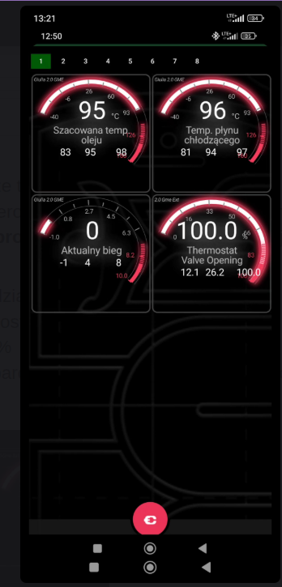

# Spec: Gauge drawing improvements

2026-10-08 · branch `feat/gauge-drawing-improvements` · **Status: implemented**

## Summary

Readability, correctness and per-frame cost fixes for the dial gauge (`GaugeDrawer`), taken from a phone Gauge-screen screenshot.

**Problem.** Scale labels were thirds of the PID range (`-40, -6, 26, 60 …`, `0.8, 2.7, 4.5 …`). The last part of every dial was painted red whether or not the PID has an alert. End-of-scale labels ran into the ticks and the card border. The min / avg / max row was unlabelled and spaced by fixed offsets. A long value ran past the dial. Four gauges used under half of a portrait screen. A value outside the PID's min..max drew the progress arc past the dial's end (or backwards).

**Scope.** `:screen_renderer` only: `GaugeDrawer`, `GaugeSurfaceRenderer`, new pure `GaugeGeometry.kt`; `renderer/Units.kt` used by every drawer that draws units. `GaugeDrawer` is shared, so items 1–5 and 7–9 also change the gauges of Performance, Drag Racing and Brake Boosting (phone and AA). No preference, query or data changes.

## Behaviour changes

| # | Area | Before | After |
| --- | --- | --- | --- |
| 1 | Scale labels | 6 equal parts of `min..max`, rounded (`-40, -6, 26 …`) | "Nice" steps (1, 2, 2.5, 4, 5 × 10ⁿ), 4–7 intervals, the range extended to the nearest step: `-40, 0, 40 … 160`; gear `-2, 0, 2 … 10` |
| 2 | Red zone | Last ~2 labels / ticks red on every dial (fixed divider indexes) | Red over the PID's alert ranges (`alert.upperThreshold`..max, min..`alert.lowerThreshold`). *Superseded by [gauge-view-improvements](gauge-view-improvements.md) item 14:* the last quarter of every dial is red again, thresholds or not |
| 3 | Label placement | Drawn before the ticks, so the red ticks' glow covered the end labels | Drawn after the ticks; centred at 0.75 r as before, moved inward only if the label would reach past 0.85 r |
| 4 | Stats row | Fixed offsets from the centre, no captions | Measured, centred, equal gaps; `▼` before min, `▲` before max. Scaled down to fit 90 % of the card and, when the dial ends below its centre, the space left of the end label |
| 5 | Value text | Fixed size | Shrunk (never enlarged) to 70 % of the dial width with its unit; label / stats stay where they were |
| 6 | Phone layout | Square cards | When the grid does not scroll, cards share the free height up to 1.5 × width; dial centred, module name / rate stay in the card's top corners |
| 7 | Out-of-range value | Arc drawn past the end, or backwards below min | Clamped to the dial |
| 8 | Arc angle | Truncated to whole degrees | Float |
| 9 | Scale bitmap cache | Keyed by PID id, size, colour; numbers skipped while the value was still `null`, and that numberless dial stayed cached | Also keyed by scale, red zones and whether numbers are drawn; numbers skipped only for non-numeric values; the replaced bitmap is recycled |
| 11 | Dial position (phone) | Dial square centred in the card; a 200° dial draws nothing below 40° under its centre, so the bottom third of each card was empty | The drawn part of the arc (from its start / sweep angles) is centred in the card (`GaugeGeometry.dialTopOffset`) |
| 12 | Units | `C` as defined in the ObdMetrics PID resources | `°C` / `°F` on every surface-rendered screen (gauge, Giulia, Trip Info, Performance, status panel) via `displayUnits()`; the PID data, exports and logs keep `C` |
| 10 | Per frame | New `RadialGradient` per gauge; colour parsed / resolved per frame | Gradient cached per PID and card rect; colours resolved once |

## Settings / keys touched

None.

## Implementation

* `GaugeGeometry.kt` (pure, unit-tested): `GaugeScale.of(min, max)` picks the step by least range extension, then interval count nearest 5; `fraction()` clamps. `GaugeRedZones` turns thresholds into scale fractions. `GaugeGeometry.labelCenterRadius`, `statsMaxWidth`, `fitScale`, `statsRow`, `cardHeight`.
* Lesson from the first device run: pulling every side label inward by its width put the end label (40° below centre on a 200° dial) into the stats row, which the `▼`/`▲` captions had made wider. The original overlap was draw order (ticks over numbers), not radius.
* `GaugeDrawer`: `pidScale(metric)` caches scale + zones per PID, invalidated when min/max/thresholds change. Progress, numbers and ticks all use the scale's fraction. Ticks: majors on the labels, minors halfway; outer gray majors outside zones; in each zone the glowing dense ticks plus a solid band over its outer half. `DrawerSettings.dividersCount`, `dividersStepAngle`, `dividerHighlightStart` removed (no caller set them).
* `GaugeSurfaceRenderer` (phone only, not landscape single-column): `rowHeight = cardHeight + 2 × margin`; `borderRects` take the card height, the dial top is offset by half the slack. The free height excludes `CONTENT_BOTTOM_PADDING`, otherwise a filled grid scrolls by a few pixels.

## Backward compatibility

Visual only. Existing profiles keep their PIDs and ranges; the dial's range may extend slightly past a PID's min/max to the nearest step (gear `-1..10` → `-2..10`), so the progress arc's position for the same value can shift a little. Dials with no alert thresholds lost their decorative red end (restored for all dials by gauge-view-improvements item 14).

## Tests

`screen_renderer/src/test/.../gauge/GaugeGeometryTest.kt`:

| Test | Pins |
| --- | --- |
| temperature scale uses round labels instead of thirds of the range | `-40..160` → `-40, 0, 40 … 160` |
| gear scale has integer labels instead of 0,8 and 2,7 | `-1..10` → `-2 … 10` |
| common ranges get round steps without extending the range | 0..100, 0..8000, 0..300, 0..3 |
| scale always covers the PID range with 4 to 7 intervals | Invariant over assorted ranges |
| no negative zero label / invalid range falls back to a single interval | Edge cases |
| value outside the scale sticks to its ends | Item 7 (clamp) |
| red zones come from the alert thresholds only / thresholds beyond the scale draw no zone | Item 2 |
| labels keep their radius unless they would reach into the ticks | Item 3 |
| stats row stays clear of the end label when the dial ends below its centre / uses the card when it ends at or above | Item 4 |
| stats row is centred with equal gaps / wider than the card is scaled down | Item 4 |
| value text is only ever shrunk | Item 5 |
| cards fill the free height up to a limit, stay square when scrolling | Item 6 |
| phone dial is centred on what it draws / upper half dial moves to the middle / full circle dial stays | Item 11 |
| `UnitsTest`: bare temperature units get the degree sign / other units are drawn as defined | Item 12 |

## Risks and verification checklist

- [ ] Phone Gauge screen, portrait, 4 gauges: cards fill the height, no scrollbar, module name in the card corner.
- [ ] Portrait, many gauges (scrolls): cards square as before.
- [ ] Landscape, 1 and several gauges.
- [ ] A PID with an upper alert threshold shows red from the threshold; one without shows no red.
- [ ] Edit a PID's min/max: the dial redraws.
- [ ] A gauge showing `--` (no value yet) still shows its scale numbers.
- [ ] End label (e.g. `120`) does not touch the `▲` max value.
- [ ] Performance, Drag Racing, Brake Boosting gauges (phone + AA DHU): labels readable, no overlap with ticks.
- [ ] Phone, square (scrolling) cards: dial and stats sit in the middle of the card, the arc's end stays inside it.
- [ ] Temperatures read `°C` on Gauge, Giulia, Trip Info, Performance and the AA status panel.
- [ ] `▼` / `▲` render (font fallback) on the target devices.

## Out of scope

* `°C` in the `:app` views (Dashboard, graph marker, DTC details): they format units themselves; `displayUnits` would have to move to `:common` first.
* Fixing `C` in the ObdMetrics PID resources: a separate repository, and the unit also feeds exports and logs.

* Pre-rendering the progress glow: the arc changes every frame, so it cannot be cached; the `BlurMaskFilter` cost was not measured.
* Captions in words (`min / avg / max`): would need strings in `:app`'s resources for both locales.
