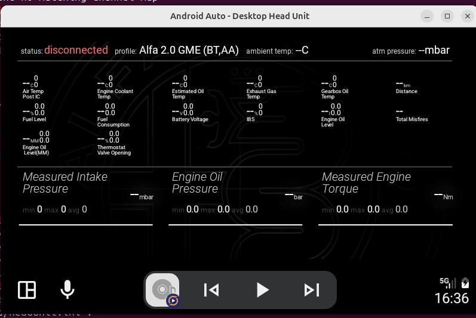

# Spec: Trip Info layout polish

2026-10-04 · branch `feat/trip-info-layout-polish` (stacked on `feat/trip-info-dynamic-pids`) · **Status: proposed, not implemented**

## Summary

A list of readability and polish improvements for the Trip Info screen, taken from an Android Auto Desktop Head Unit screenshot (800 × 480, disconnected).

**Problem.** On a wide, short display the top grid is hard to read: labels are about 8 px tall while the bottom row's are about 18 px, and a lot of height goes unused. Each grid cell shows three numbers of nearly equal weight (value, min, max). Placeholder statistics (`0`, `0.0`) look like real readings when there is no data. Alignment, units and a few labels are inconsistent.

**Scope.** `:screen_renderer` (`TripInfoDrawer`, `TripInfoMetrics`, `GiuliaDrawer`, `AbstractDrawer` status panel); possibly the status-panel strings in `:app`. No query, preference-key or data changes.

**Breaking-change classification.** Items are tagged **[visual]** when they change how the screen looks for every existing user, and **[fix]** when they correct something that is plainly wrong. The previous PR promised no layout changes, so **[visual]** items need explicit sign-off and could go behind an opt-in setting (see Open questions).

## Proposed changes

| # | Area | Today (screenshot) | Proposal | Tag |
| --- | --- | --- | --- | --- |
| 1 | Grid text size | `textSizeBase = width / 22 × fontScale`, width only, so short displays get tiny text and unused height | Size the grid from the available height as well: the largest text that fits `rows × rowHeight` between the grid top and the divider, capped by the width-based size | visual |
| 2 | Value vs. statistics | Min/max stacked right next to the value at 0.6× its size, both coloured | Show statistics smaller (about 0.45×) and grey, and hide them until the metric has a real sample | visual |
| 3 | Alignment | Grid values are left-aligned next to the label; bottom values are right-aligned (`valueLeft = metricRight − MARGIN_END`), leaving a wide gap after the label | One rule for both: value left-aligned under or after the label, stats beside it | visual |
| 4 | Units | Drawn at 0.4× on the value baseline with only `5 %` padding: `--mbar`, `--MM` | A real gap before the unit (a fraction of the value size), unit at about 0.5×, vertically aligned with the value's x-height | fix |
| 5 | Status panel | `ambient temp: --C`, `--mbar`: no degree sign, no space | Format as `-- °C` / `-- mbar`. The unit comes from `pid.units`, so map a bare `C` to `°C` at render time, or fix the PID resource | fix |
| 6 | Label text | `Engine Oil Level(MM)`: missing space, unit duplicated in the label | Fix the PID description in its resource (ObdMetrics / profile PID files). No renderer change | fix (data) |
| 7 | Row spacing | Row height is fixed at `1.8 × textSizeBase`; a two-line label ("Air Temp / Post IC") nearly touches the next row's value, and a third line would overlap it | Row height = value height + tallest label height in that row (measured as drawn); or cap labels at two lines and ellipsize | fix |
| 8 | No-data state | `--` with `min 0 max 0 avg 0` and empty progress bars; the zeros read as measurements | Until the first sample: show `--` only; hide stats and bars | fix |

### Notes per item

1. **Grid sizing.** Belongs in `TripInfoDrawer.calculateLayout` / `TripInfoMetrics.grid()`. The available height is `divider top − grid top`, which needs the bottom row's height, so compute the bottom row first. Keep the user's font-size setting as a multiplier. Interacts with the >18-item shrinking, so both must come from one function, which should stay Canvas-free and unit-tested.
2. **"Has a sample".** Needs a signal on `Metric` (e.g. a sample count, or `source.value != null`). Check what `MetricsBuilder` sets for a metric that has never been read before relying on min/max being 0.
3. **Alignment.** `GiuliaDrawer.drawMetric` (bottom row) is shared with the Giulia screen, so changing its alignment there changes Giulia too. Pass alignment as a parameter rather than changing the default.
4. **Units.** `TripInfoDrawer.drawValue` handles the grid; `GiuliaDrawer.drawValue` handles the bottom row. Performance uses `TripInfoDrawer.drawMetric`, so it changes as well, which is intended for consistency.
5. **Status panel.** `AbstractDrawer.drawStatusPanel` concatenates `format() + units`. The fix is shared by every screen with a status panel.
7. **Row height.** `CLAUDE.md` already notes that labels have no width clamp and that a 3+ line label overlaps. Whatever height rule is chosen, label measurement must match drawing (split on `\n` only when breaking is enabled).
8. **Disconnected state.** Also applies to the `diff` (distance) metric, which currently shows `--km`.

## Settings

None planned. If **[visual]** items need to stay opt-in: a new boolean, e.g. `pref.aa.trip_info.compact_layout` (code default `false`, matching the XML default), with EN + PL strings.

## Implementation order

1. Fixes with no visible change on a connected car: 5, 8, 4.
2. Row height (7), together with the unit test for label measurement.
3. Grid sizing (1), then value/stats styling (2) and alignment (3), as one reviewable visual change with before/after screenshots.

## Backward compatibility

- No pref keys, stored values or queries change.
- **[fix]** items change only what is plainly wrong: placeholders, missing degree sign, spacing, overlap.
- **[visual]** items alter the layout for every user. Either accept that explicitly in the PR, or put them behind the opt-in setting.
- Shared drawers (`GiuliaDrawer`, `AbstractDrawer` status panel, `TripInfoDrawer.drawMetric` used by Performance) affect other screens; each item lists where.

## Tests

- `TripInfoMetricsTest`: the height-aware grid sizing (fits within the given height; never larger than the width-based size; 0–18 items unchanged when height is not the limit) and the row-height rule.
- Unit-format helper (degree sign, unit spacing) as a pure function with tests.
- "Has a sample" logic: Robolectric test in `:datalogger` if it lives on `Metric` / `MetricsBuilder`.
- Manual before/after screenshots on DHU at 800 × 480 and at a wide resolution, connected and disconnected, for Trip Info, Performance and Giulia.

## Risks and verification

- Shared drawers mean a Trip Info fix can shift Giulia or Performance; compare screenshots of all three.
- Larger grid text from item 1 may bring back label overlap; do item 7 first.
- Hiding stats before the first sample must not hide them for PIDs whose genuine value is 0.

Verification:

- [ ] `./gradlew :screen_renderer:testDebugUnitTest` passes
- [ ] `./gradlew assembleGiuliaDebug` builds; `spotlessApply` leaves no diff
- [ ] Manual: DHU 800 × 480 and a wide resolution, disconnected and on a connected car (or the `mock` connection)
- [ ] Manual: Performance and Giulia screens unchanged except for the intended shared fixes

## Open questions

- Ship **[visual]** items as the new default, or behind `pref.aa.trip_info.compact_layout`?
- Should the phone Trip Info get the same treatment? It uses the same drawer, but its font setting has a different default (30 vs. 24).
- Fix the `Engine Oil Level(MM)` label in the PID resources here, or in a separate data PR?

## Out of scope

- New PIDs or data, query changes.
- Paging the grid (see `trip-info-dynamic-pids.md`).
- Redesigning the bottom row's progress bars.
